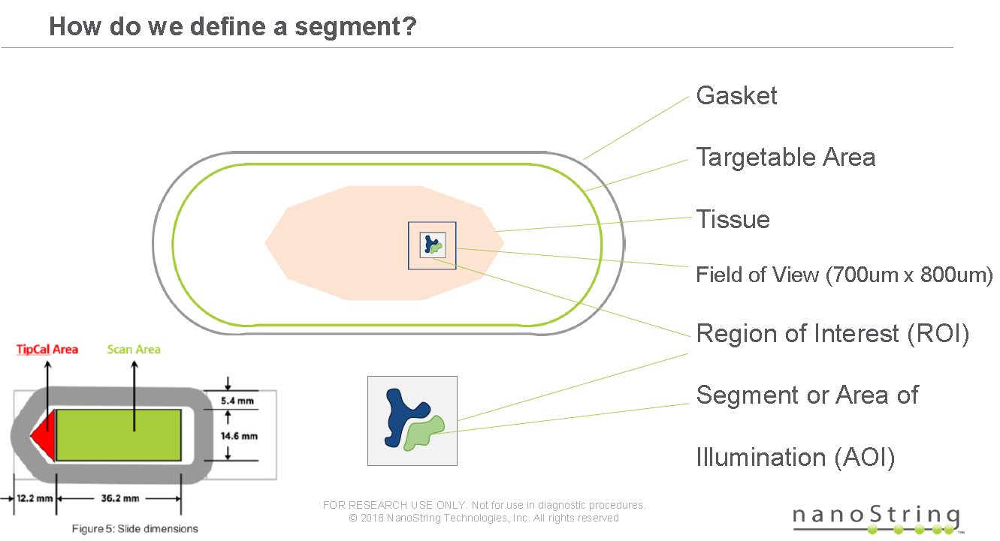

```{r setup, include=FALSE}
knitr::opts_chunk$set(echo = FALSE)
```

## Overview

- What does it measure?
- How does it measure it? Technology / Chemistry
- Set up or deployment: Training from company, troubleshooting
- Technical Pros/Cons
- Costs and Throughput

## What does the technique measure?

- GeoMx: Proteins and RNA in human FPPE and frozen samples, Proteins in Mouse FPPE and frozen samples.
- Visium: RNA in human frozen samples

## GeoMx: How does it measure it?

- Protein detection: antibody based
- RNA detection: known sequence oligo
- Quantification: nCounter, each 'Reporter Tag' is counted in a dedicated separate instrument.

## GeoMx: Technical Advantages:
```{r , echo=FALSE, fig.align='center', out.width='80%', fig.show='asis'}


```

- Quantitative: nCounter technology in use for a decade, R probe count is highly specific and reproducible (Veldman-Jones, 2015). No amplification step.
- Most of the steps (staining, collection and readout) are automated decreasing operator bias.

## GeoMx: Technical Limitations:

- Resolution limitations, can resolve (in theory) single cell but would be extremely expensive (one well).
- Area of illumination must be larger for RNA from FFPE.
- Region of interest cannot be larger than 700x800 $\mu M$
- Antibodies and DNA probes pre-selected by NanoString (or requested by user at a cost).
```{r , echo=FALSE, fig.align='center', out.width='80%', fig.show='asis'}

```


## GeoMx: Throughput
- Four slides loaded into the instrument.
- Staining: prep 4 hrs, ON, 3 hrs
- Collection: with user ~3 hrs
             without user depends on how many areas were collected.
             If 96 wells ~3hrs.
             
